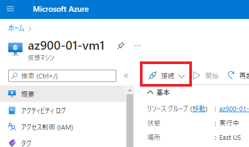
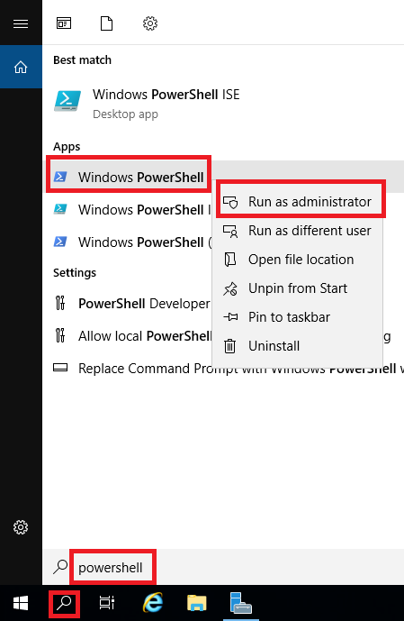
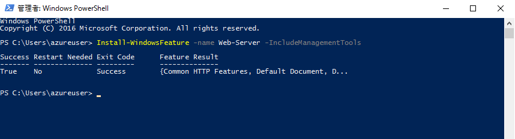
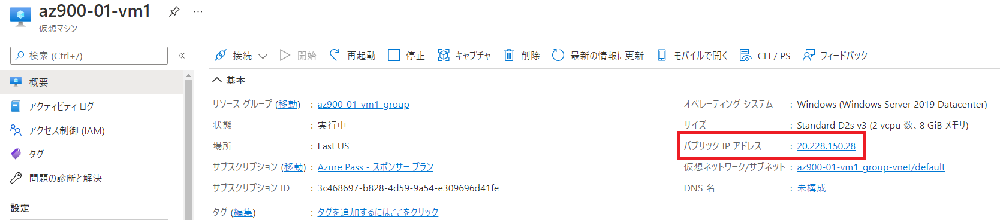
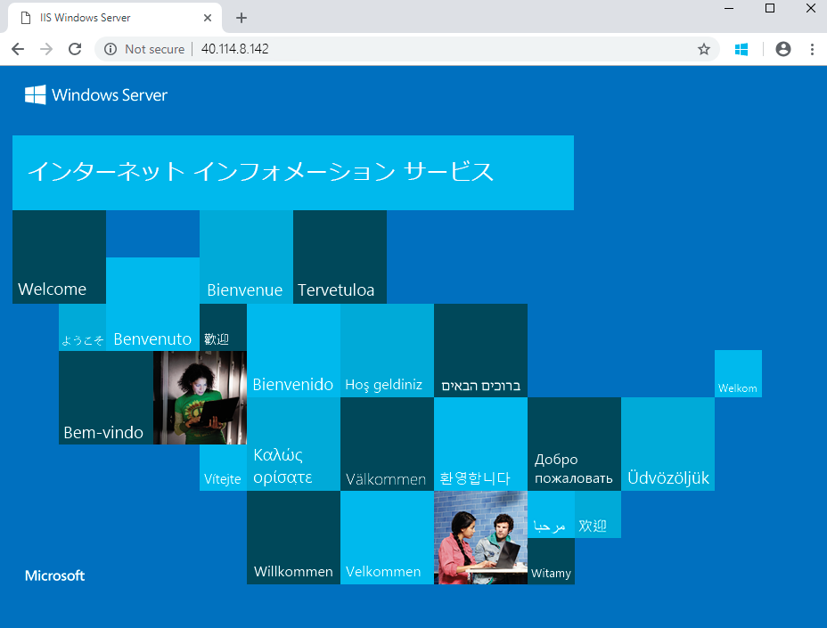

---
wts:
    title: '01 - ポータルで仮想マシンを作成する (10 分)'
    module: 'モジュール 02 - Azure のコア サービス (ワークロード)'
---
# 01 - ポータルで仮想マシンを作成する (10 分)

このラボでは、Azure Portalで仮想マシンを作成、仮想マシンに接続してWebサーバーロールをインストールして接続テストをします。 

# タスク 1: 仮想マシンを作成する 
1. Azure Portal　([https://portal.azure.com](https://portal.azure.com)) にサインインします。

2. Azure Portalで、「**Virtual Machines**」を検索して選択し、「**+ 作成**」をクリックして、ドロップダウンリストから「**Azure仮想マシン**」を選択します。

3. 「**基本**」タブで、次の情報を入力します （記載のない項目は既定値のまま設定）。

    | 設定 | 値 |
    |  -- | -- |
    | サブスクリプション | **Azure Pass - スポンサープラン** |
    | リソース グループ    | **AzureStudent##**                                       |
    | 仮想マシン名 | **az900-01-vm1** |
    | 地域 | **(US) East US** or **(US) West US** |
    | 可用性オプション | インフラストラクチャ冗長は必要ありません |
    | イメージ | **Windows Server 2022 Datacenter: Azure Edition - Gen2** |
    | サイズ | **Standard_DS1_v2** |
    | ユーザー名 | **Student** |
    | パスワード | **Pa55w.rd1234** |
    | パブリック受信ポート | **選択したポートを許可する** |
    | 受信ポートを選択 | **HTTP (80)** , **RDP (3389)** |

4. 「次：ディスク >」をクリックし、既定値から変更せず「次：ネットワーク >」をクリックします。

5. 「ネットワーク」 タブでは、「**受信ポートを選択**」 セクションで **HTTP (80) と RDP (3389)** が選択されていることを確認します。

6. 「次：管理 >」 をクリックし、既定値から変更せず「次：Monitoring >」をクリックします。

7. **Diagnostics** セクションで次の設定を選択します。

    | 設定 | 値 |
    | -- | -- |
    | Boot diagnostics | **Disable** |

8. 残りの値は既定値はそのままにして、ページの下部にある **「確認および作成」** をクリックします。

9. 検証に成功と表示されたら、「**作成**」ボタンをクリックします。仮想マシンをデプロイするには、1～5分かかる場合があります。

10. デプロイ ページ上と **「通知」** 領域 (トップ メニュー バーのベル アイコン) を通して更新を受信します。

# タスク 2: 仮想マシンに接続する

このタスクでは、RDP (リモート デスクトップ プロトコル) を使用して新しい仮想マシンに接続します。 

1. 上部の青いツール バーからベル アイコンをクリックし、展開が成功したら 「リソースに移動」 を選択します。 

    **注**: 「デプロイ」 ページにて「**デプロイが完了しました**」表示後は、 「**リソースに移動**」 リンクを使用することもできます。 

2. 仮想マシンの **「概要」** ブレードで、**「接続」** ボタンをクリックして、ドロップダウンから **「RDP」** を選びます。

    

    **注**: 次の手順では、Windows コンピューターから VM に接続する方法を説明します。Mac では、Mac App Store にある Remote Desktop Client などの RDP クライアントが必要です。また、Linux コンピューターでは、オープンソースの RDP クライアント ソフトウェアを使用できます。

2. **「接続」** ブレードで、ポート 3389 経由でパブリック IP アドレスから接続する既定のオプションを保持し、**「RDP ファイルのダウンロード」** をクリックします。

3. ダウンロードした RDP ファイルを**開き**、プロンプトが表示されたら 「**接続**」 をクリックします。 

    

4. 「**Windows セキュリティ**」 ウィンドウで、仮想マシンの作成時に設定した管理者ユーザ名「**Student**」とパスワード「 **Pa55w.rd1234**」 を使用してサインインします。 

5. サインイン プロセス中に証明書の警告が表示されることがあります。「**はい**」をクリックして仮想マシン に接続します。正常に接続されるはずです。

    

新しい仮想マシン (az900-01-vm##) に接続されました。サーバー マネージャーのポップアップ表示とダッシュボード ウィンドウが表示されます。 これで、Windows Server を実行している仮想マシンがデプロイおよび接続を確認できました。 

# タスク 3: Web サーバー ロールをインストールしてテストする

このタスクでは、作成した仮想マシンに Web サーバーロールをインストールし、既定の IIS ウェルカム ページが表示されることを確認します。 

1. 前のタスクで接続した仮想マシンで、スタートメニューより**PowerShell**を検索し、**Windows PowerShell**を右クリックして「**More**→**Run as administrator**」します。

    

2. PowerShell で、次のコマンドを実行して、仮想マシンに **Web サーバー**機能をインストールします。(コピーアンドペーストでコマンドを貼り付け、Enterキーを押してインストールを開始します)。

    ```PowerShell
    Install-WindowsFeature -name Web-Server -IncludeManagementTools
    ```
  
3. 完了すると、 **「True」**、**「Success」** と表示され、インストールが成功したプロンプトが表示されます。インストールを完了するために仮想マシンを再起動する必要はありません。仮想マシンの上部中央にある青いバーの 「**x**」 をクリックして、仮想マシンへの RDP 接続を閉じます。上部中央の青いバーの 「**-**」 をクリックして最小化することもできます。

    

4. ポータルに戻り、az900-01-vm##の **「概要」** ブレードに移動し、**「クリップボードにコピー」** ボタンを使用して仮想マシンのパブリック IP アドレスをコピーします。ブラウザで新しいタブを開いて、パブリック IP アドレスを URL テキスト ボックスに貼り付け、**Enter** キーを押して閲覧します。

    

5. IIS Web サーバーの既定のウェルカム ページが表示されます。

    

パブリック IP アドレスを介してアクセスできる、 Web サーバーが実行された仮想マシンを作成しました。アプリケーション ファイルを仮想マシンにデプロイし、パブリック アクセス可能なWeb アプリケーションをホストできます。
