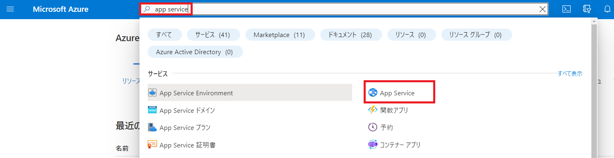
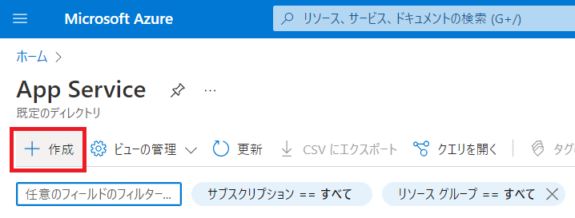
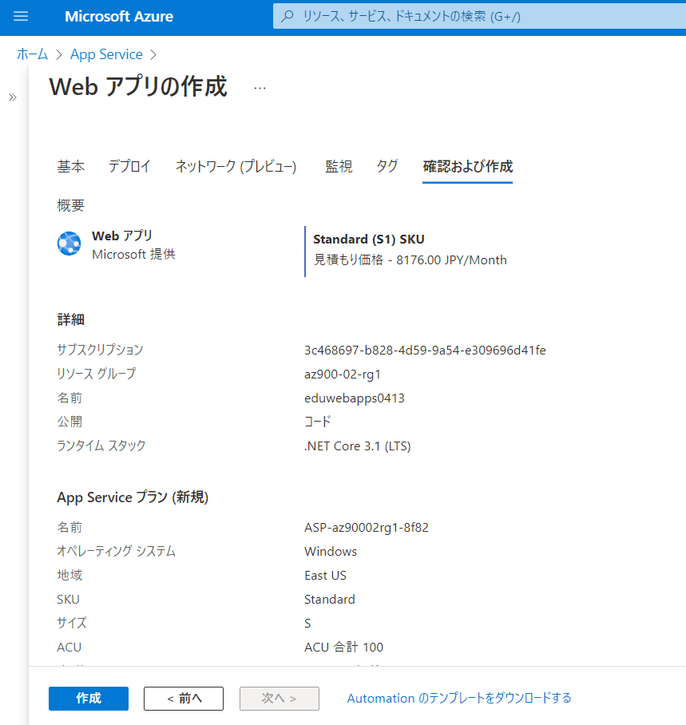
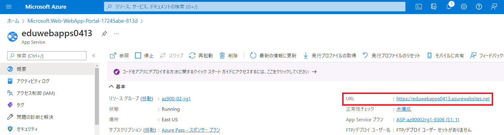

---
lab:
    title: 'Lab2 Webアプリを作成する	'
    learning path: '02'
    module: 'Module2 Azureのコアサービス'
---

# ラボ 02: Webアプリを作成する

このラボでは、Azure Portalを使用してApp Serviceを作成し、Webページを公開します。

#### 推定時間: 10 分

## 演習 1 - Azure App Service から「Webアプリ」を作成

### タスク 1 - Webアプリを作成する

1. Azure Portal　([https://portal.azure.com](https://portal.azure.com)) にサインインします。

    
   
2. Azure Portalで「**app service**」と入力して検索結果を選択してください。

     

       

3. 画面左上の「**+作成**」を選択してください。

     

     

4. App Serviceの作成画面が表示されます。「**プロジェクトの詳細**」を入力します。

     | 設定               | 値                                 |
     | ------------------ | ---------------------------------- |
     | サブスクリプション | **Azure Pass - スポンサー プラン** |
     | リソースグループ   | **AzureStudent##**                 |

     
     
5. 「**インスタンスの詳細**」を入力します。

     | 設定               | 値                     |
     | ------------------ | ---------------------- |
     | 名前               | **eduwebapps##$$$$**   |
     | 公開               | **コード**             |
     | ランタイムスタック | **.NET Core 3.1(LTS)** |
     | 地域               | **East US**            |

     > 注：##は受講番号を、$$$$は本日の月日を入力します。 (例：受講番号01、9月30日の場合→eduwebapps010930)
     >
     
     
     
6. 「**App Service プラン**」は規定値から変更せず、「**確認および作成**」を選択します。

     

7. 検証が完了したら、画面左下部の「**作成**」を選択します。

     

     

8. 1分ほどでApp Serviceの作成が完了となります。

     

       

9. デプロイ完了後、「**リソースに移動**」を選択してください。

   
   
     


### タスク 2 - サンプルのWebページを確認する

1. App Serviceブレードの画面右にある「**URL**」をクリックします。

   

   

2. サンプルのページが表示されます。

   
   
   

### タスク 3 - Webアプリを実装する

1. App Serviceブレードの左側にある「**開発ツール**」セクションの「**App Service Editor(プレビュー)**」を選択し「**移動**」をクリックします。

    

   

2. エディタが表示されます。「**hostingstart.html**」を**右クリック**し「**Delete**」を選択し削除します。

   
   
   

5. 画面左側にある「**Git**」アイコンを選択します。

   
   
   
   
5. 「**Repository URL**」に以下のURLを入力し「**Clone from a git URL**」を選択します。

   ```
   https://github.com/ctct-edu/ctc-travel-agency.git
   ```
   
   > 注：このURLは「Github」上に公開しているサンプルのリポジトリになります。
   >
   > 　　GitHub上にあるWebアプリのデータを自分のApp Service上にコピーし実装することが可能です。
   >
   > 　　試しにURLにアクセスすると、GitHubのページが表示されます。
   
   
   
   
   
5. リポジトリがコピーされました。画面右側の最終行で「**remote : Tolal ～**」と表示されます。

   
   
     

### タスク 4 - 更新されたWebページを確認する

1. App Serviceブレードに戻り、画面右にある「**URL**」をクリックします。

   

   

2. サンプルのページが表示されます。


これでApp Serivceを使い、Webページを公開することが出来ました。

**注**: 追加コストを回避するために、作成したリソース グループを削除できます。リソース グループを検索して選択し、作成したリソース グループをクリックして、「**リソース グループの削除**」をクリックします。リソース グループの名前を入力し、「**削除**」をクリックします。
