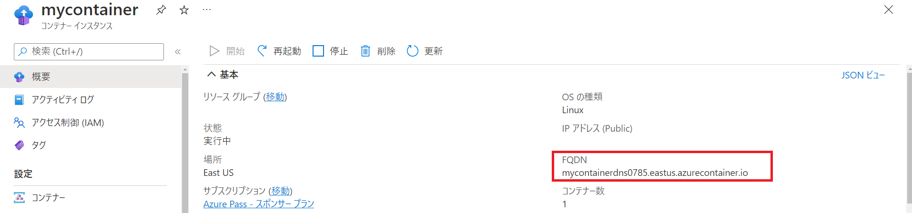
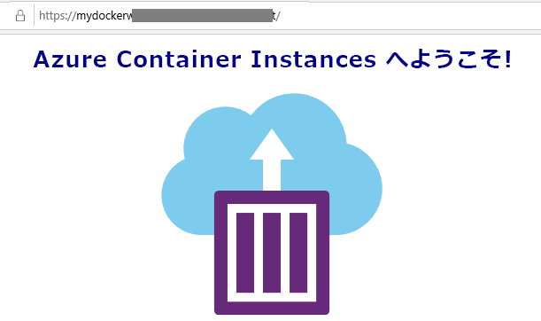

---
wts:
    title: '03 - Azure Container Instances をデプロイする (10 分)'
    module: 'モジュール 02 - Azure のコア サービス (ワークロード)'
---

# 03 - Azure Container Instances をデプロイする (10 分)

このチュートリアルでは、Azure portal で Azure Container Instances (ACI) を使用してコンテナーを作成、構成、デプロイします。このコンテナーは、静的な HTML ページを表示する「ACI Web アプリケーションへようこそ」です。 

# タスク 1: コンテナー インスタンスの作成 

このタスクでは、Web アプリケーションの新しいコンテナー インスタンスを作成します。 

1. Azure portal　([https://portal.azure.com](https://portal.azure.com))にサインインします。

2. Azure portalで「**コンテナー インスタンス**」を検索して選択し、**「+ 作成」** をクリックします。 

3. 「**コンテナー インスタンスの作成**」 ブレードの「**基本**」タブで次の通り設定します。 (その他の情報は既定値のままにします)): 

	| 設定| 値|
	|----|----|
	| サブスクリプション | **Azure Pass - スポンサープラン** |
	| リソース グループ | **AzureStudent##** |
	| コンテナー名| **mycontainer**|
	| 地域 | **(US) East US** |
	| イメージのソース| **その他のレジストリ** |
	| イメージの種類| **パブリック**|
	| イメージ| **mcr.microsoft.com/azuredocs/aci-helloworld**|
	| OS の種類| **Linux** |
	| サイズ| ***既定値のままにします***|

4. 「次：ネットワーク >」をクリックし、ネットワーク設定を実施します (**xxxx** をグローバルに一意になるように文字と数字に置き換えます)。その他の設定はすべてデフォルト値のままにします。

  | 設定| 値|
  |--|--|
  | DNS 名ラベル| **mycontainerdns##$$$$** |

  **注**: 注：##は受講番号を、$$$$は本日の月日を入力します。 (例：受講番号01、9月30日の場合→eduwebapps010930)

  コンテナーは、dns-name-label.region.azurecontainer.io でパブリックからアクセスできるようになります。デプロイ後に **DNS 名ラベルは使用できません** というエラー メッセージが表示された場合、別の DNS 名ラベルを指定して再 デプロイします。 

5. 「**確認および作成**」 をクリックし、「**作成**」 をクリックしてコンテナー インスタンスを作成します。 

7. デプロイ ページと 「**通知**」 ページを監視します。 

# タスク 2: コンテナー インスタンスのデプロイを確認する

このタスクでは、ウェルカム ページが表示されることを確認して、コンテナー インスタンスが実行されていることを確認します。

1. 上部の青いツール バーからベル アイコンをクリックし、展開が成功したら 「リソースに移動」 を選択します。 

   **注**: 「デプロイ」 ページにて「**デプロイが完了しました**」表示後は、 「**リソースに移動**」 リンクを使用することもできます。 

2. **mycontainer** の 「**概要**」 ブレードで、 「**状態**」 が 「**実行中**」 であることを確認します。 

3. 「**概要**」ブレードで **FQDN** を探して、クリップボードにコピーします。

  

4. 新しいブラウザー ウィンドウでき、FQDN を貼り付けて、Enter キーを押します。Azure Container Instance へようこそ! ウェルカム メッセージが表示されます。 

  

Azure portal を使用して、Azure Container Instances のコンテナーにアプリケーションがデプロイされました。
