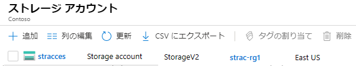
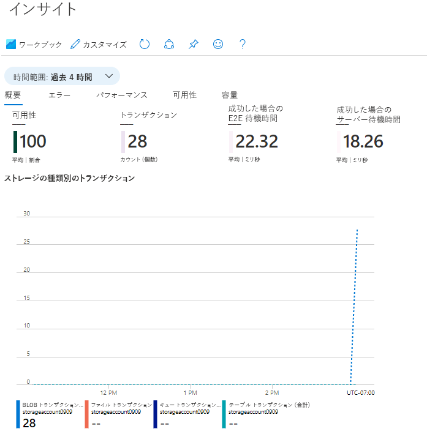

---
wts:
    title: '05 - Blob Storage を作成する (5 分)'
    module: 'モジュール 02 - Azure のコア サービス (ワークロード)'
---
# 05 - Blob Storage を作成する (5 分)

このチュートリアルでは、ストレージ アカウントを作成し、Blob Storage ファイルを操作します。

# タスク 1: ストレージ アカウントを作成する 

このタスクでは、新しいストレージ アカウントを作成します。 

1. Azure portal　([https://portal.azure.com](https://portal.azure.com))にサインインします。

2. Azure portalで「**ストレージ アカウント**」を検索して選択し、**「+ 作成」** をクリックします。 

3. 「**ストレージ アカウントの作成**」 ブレードの 「**基本**」 タブで次の情報を入力します (ストレージ アカウントの名前の **xxxx** は、名前がグローバルに一意になるように文字と数字に置き換えます)。その他は既定値のままにします。

    | 設定 | 値 |
    | --- | --- |
    | サブスクリプション | **Azure Pass - スポンサープラン** |
    | リソース グループ（新規作成） | **az900-05-rg1** |
    | ストレージ アカウント名 | **storageaccountxxxx** |
    | 地域 | **(US) East US** |
    | パフォーマンス | **Standard** |
    | 冗長性 | **ローカル冗長ストレージ (LRS)** |

    **注** -  **xxxx** を変更して、一意の **ストレージ アカウント名** となるようにしてください

4. 「**確認および作成**」 をクリックして、ストレージ アカウントの設定を確認し、Azure が構成を検証できるようにします。 

5. 検証できたら、 「**作成**」 をクリックしますアカウントが正常に作成されたことを示す通知を待ちます。 

6.  「**ストレージ アカウント**」ブレードに移動し、作成したストレージ アカウントが表示されていることを確認します。

    

# タスク 2: Blob Storage を操作する

このタスクでは、BLOB コンテナーを作成し、BLOB ファイルをアップロードします。 

1. 「**ストレージ アカウント**」ブレードで、前のタスクで作成したストレージアカウントをクリックし、左側のメニューの「**データ ストレージ**」セクションから「**コンテナー**」をクリックします。

2. 「**+ コンテナー**」をクリックして、情報を入力します。完了したら、「**作成**」をクリックします。

   | 設定                       | 値                                           |
   | -------------------------- | -------------------------------------------- |
   | 名前                       | **container1**                               |
   | パブリック アクセス レベル | **プライベート（匿名アクセスはありません）** |

3. 新しいブラウザー ウィンドウを開き、**Bing**　で花の画像を検索します。画像を右クリックして VM に保存します。 

4. Azure portalに戻り、**container1** をクリックして、「**アップロード**」 をクリックします。
5. ローカル コンピューターを参照し、保存した画像ファイルを選択してから、「**アップロード**」 をクリックします。

# タスク 3: ストレージ アカウントを監視する

1. ストレージ アカウント ブレードに戻り、「**問題の診断と解決**」をクリックします。 

2. 一般的なストレージの問題を確認します。複数のトラブルシューティング ツールがあること確認できます。

3. ストレージ アカウントのブレードで、 「**監視**」 セクションまでスクロールして 「**分析情報**」 をクリックします。障害、パフォーマンス、可用性、容量に関する情報があることを確認します。環境によって情報は異なります。

    

**注**: 追加コストを回避するために、作成したリソース グループを削除できます。リソース グループを検索して選択し、作成したリソース グループをクリックして、「**リソース グループの削除**」をクリックします。リソース グループの名前を入力し、「**削除**」をクリックします。**通知**を監視して、削除の進行状況を確認します。
