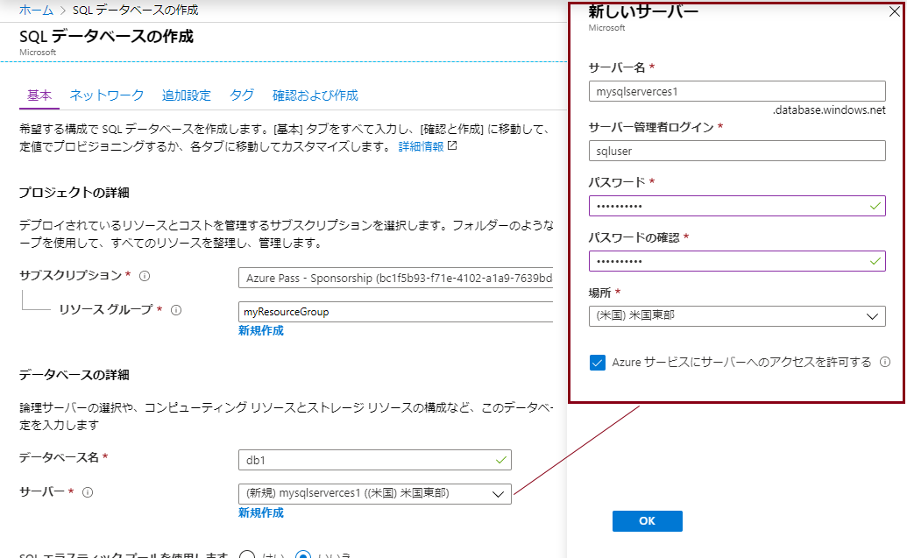
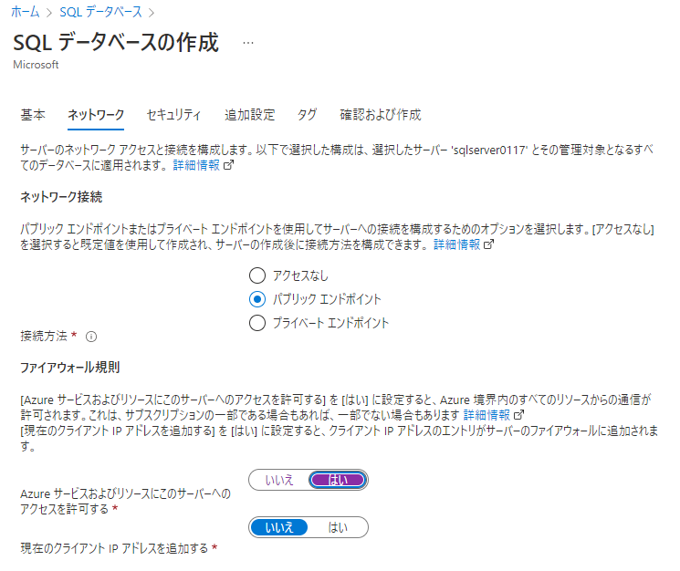
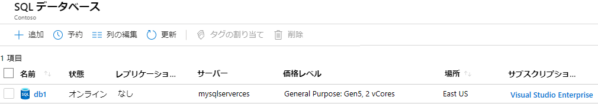
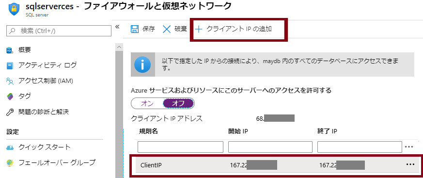
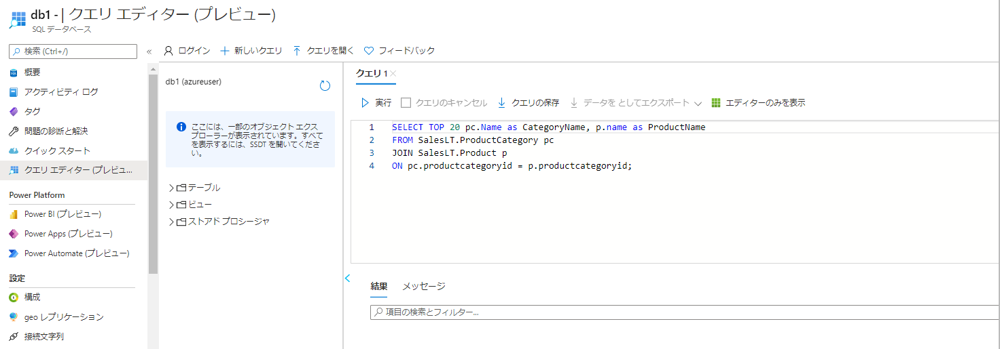
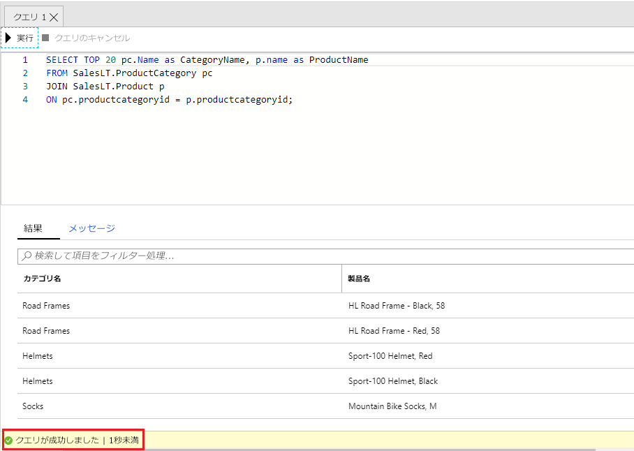

---
wts:
    title: '06 - SQL Database を作成する (5 分)'
    module: 'モジュール 02 - Azure のコア サービス (ワークロード)'
---

# 06 - SQL Database を作成する (5 分)

このチュートリアルでは、Azure で SQL Database を作成し、そのデータベース内のデータをクエリします。

# タスク 1: データベースを作成する 

このタスクでは、AdventureWorksLT サンプル データベースに基づいて、SQL データベースを作成します。 

1. Azure portal　([https://portal.azure.com](https://portal.azure.com))にサインインします。

2. Azure portalで「**SQL データベース**」を検索して選択し、**「+ 作成」** をクリックします。 

3. 「**基本**」タブで、次の情報を入力します（サーバー名の**xxxx** は、名前がグローバルに一意になるように文字と数字に置き換えます）。

   | 設定 | 値 |
   | --- | --- |
   | サブスクリプション | **Azure Pass - スポンサーブラン** |
   | リソース グループ（新規作成） | **az900-06-rg1** |
   | データベース名| **db1** |
   | サーバー | **新規作成** |
   | サーバー名 | **sqlserverxxxx** |
   | 場所 | **(US) East US** |
   | 認証方法 | **SQL 認証を使用する** |
   | サーバー管理者のログイン | **sqluser** |
   | パスワード | **Pa55w.rd1234** |

   

4. サーバーの情報を入力したら「**OK**」をクリックし、「**SQLデータベースの作成**」ブレードに戻り「**次：ネットワーク >**」をクリックします。

5. 「**ネットワーク**」タブで、次の設定を構成します (その他は既定値のままにしておきます)。 

   | 設定 | 値 |
   | --- | --- |
   | 接続方法 | **パブリック エンドポイント** |
   | Azure サービスおよびリソースにこのサーバーへのアクセスを許可する | **はい** |
   | 現在のクライアント IP アドレスを追加する | **いいえ** |

   

6. 「**次：セキュリティ >**」をクリックして**セキュリティ** タブに移動し、以下の設定を変更します。 

    | 設定 | 値 |
    | --- | --- |
    | Microsoft Defender for SQL を有効にする | **後で** |

7. 「**次：追加設定 >**」をクリックして**追加設定** タブに移動します。以下の設定を変更し、AdventureWorksLT サンプル データベースを使用します。

    | 設定 | 値 | 
    | --- | --- |
    | 既存のデータを使用する | **サンプル** |

    

8. 「**確認および作成**」をクリックしてから「**作成**」をクリックして、リソース グループ、サーバー、データベースをデプロイおよびプロビジョニングします。デプロイには約 2 分から 5 分かかることがあります。


# タスク 2: データベースをテストする。

このタスクでは、SQL サーバーを構成し、SQL クエリを実行します。 

1. デプロイが完了したら、デプロイ ブレードで「**リソースに移動**」をクリックします。または、「**SQLデータベース**」を検索して選択し、新しいデータベースが作成されたことを確認します。

    

2. 作成した SQL データベースを表す **db1** エントリをクリックします。db1 ブレードで、「**クエリ エディター (プレビュー)**」をクリックします。

3. ユーザー名 「**sqluser**」 でパスワード 「**Pa55w.rd1234**」 を使用してログインします。

4. ログインすることはできません。エラーを確認し、ファイアウォール経由で許可する必要がある IP アドレスをメモしておきます。 

    

5. 「**db1**」ブレードに戻り、「**概要**」をクリックします。 

    

6. db1の「**概要**」ブレードから、概要画面の上部中央にある「**サーバー ファイアウォールの設定**」をクリックします。

7. 「**+ クライアント IP の追加**」(トップ メニュー バー) をクリックし、エラーで参照されている IP アドレスを追加します。(自動入力されている可能性があります。そうでない場合は、IP アドレス フィールドに貼り付けてください)。変更を必ず**保存**してください。 

    

8. 「**SQL データベース | db1**」ブレードに戻り、「**クエリ エディター (プレビュー)**」をクリックします。ユーザー名「**sqluser**」でパスワード「**Pa55w.rd1234**」を使用してログインします。今度は成功するはずです。新しいファイアウォール規則がデプロイされるまでに数分かかる場合があります。 

9. 正常にログインすると、クエリ ウィンドウが表示されます。エディター ウィンドウに次のクエリを入力します。 

    ```SQL
    SELECT TOP 20 pc.Name as CategoryName, p.name as ProductName
    FROM SalesLT.ProductCategory pc
    JOIN SalesLT.Product p
    ON pc.productcategoryid = p.productcategoryid;
    ```

    

10. 「**実行**」 をクリックしてから、「**結果**」 ペインでクエリの結果を確認します。クエリは正常に実行されるはずです。

    

Azure で SQL Database を作成し、そのデータベース内のデータを正常にクエリしました。

**注**: 追加コストを回避するために、作成したリソース グループを削除できます。リソース グループを検索して選択し、作成したリソース グループをクリックして、「**リソース グループの削除**」をクリックします。リソース グループの名前を入力し、「**削除**」をクリックします。**通知**を監視して、削除の進行状況を確認します。
