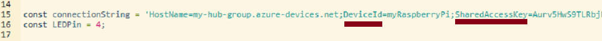

---
wts:
    title: '07 - Azure IoT Hub の実装 (10 分)'
    module: 'モジュール 03: コア ソリューションおよび管理ツールに関する説明'
---
# 07 - Azure IoT Hub の実装 (10 分)

このチュートリアルでは、Azure portal で新しい Azure IoT Hub をセットアップし、Raspberry Piシミュレーターを使用して IoT デバイスとの接続を実装します。センサー データとメッセージが Raspberry Pi シミュレーターから Azure IoT Hub に送信され、Azure portal でメッセージング アクティビティのメトリックを表示します。

# タスク 1: IoT ハブを作成する 

このタスクでは、IoT ハブを作成します。 

1. Azure portal　([https://portal.azure.com](https://portal.azure.com))にサインインします。

2. Azure portalで「**IoT Hub**」を検索して選択し、**「+ 作成」** のいずれかをクリックします。

3. 「**IoT ハブ**」 ブレードの 「**基本**」 タブで、フィールドに次の詳細情報を入力します（IoT Hub名の **xxxx** は、名前がグローバルに一意になるように文字と数字に置き換えます）。

    | 設定 | 値 |
    |--|--|
    | サブスクリプション | **Azure Pass - スポンサープラン** |
    | リソース グループ | **AzureStudent##** |
    | IoT Hub 名 | **my-hub-group##$$$$** |
    | 領域 | **East US** |

    注：##は受講番号を、$$$$は本日の月日を入力します。 (例：受講番号01、9月30日の場合→eduwebapps010930)

4. 「**次へ：ネットワーク >**」をクリックし、既定の設定を変更せず、「**次へ：管理 >**」をクリックして「**管理**」タブへ移動します。

5. 「**管理**」タブでは、「**価格とスケール レベル**」のドロップダウンメニューから「**S1: Standard レベル**」を選択します。

6. 「**確認および作成**」ボタンをクリックし、検証が完了したら「**作成**」 ボタンをクリックして、Azure IoT Hub インスタンスの作成を開始します。

7. Azure IoT Hub インスタンスがデプロイされるまで待ちます。 

# タスク 2: IoT デバイスを追加する

このタスクでは、IoT デバイスを IoT ハブに追加します。 

1. デプロイが完了したら、デプロイ ブレードで 「**リソースに移動**」 をクリックします。または、Azure portalで「**IoT Hub**」 を検索して選択し、新しい IoT Hub インスタンスを特定します

	

2. 新しい IoT デバイスを追加するには、「**デバイス管理**」セクションにスクロールして、**「デバイス」** をクリックします。次に、**「+ デバイスの追加」** をクリックします。

	

3. 「**デバイス ID**」に 「**myRaspberryPi**」 と入力し、 「**保存**」 をクリックします。これにより、Azure IoT Hub に新しい IoT デバイス ID が作成されます。

4. 新しいデバイスが表示されない場合は、「**最新の情報に更新**」をクリックします。 

5. 「**myRaspberryPi**」を選択し、 「**プライマリ接続文字列**」 の値をコピーします。次のタスクでこのキーを使用して、Raspberry Pi シミュレーターとの接続を認証します。

	

# タスク 3: Raspberry Pi シミュレーターを使用してデバイスをテストする

このタスクでは、Raspberry Pi シミュレーターを使用してデバイスをテストします。 

1. Web ブラウザーで新しいタブを開き、このショートカット リンク [https://aka.ms/RaspPi](https://aka.ms/RaspPi) を入力します。Raspberry Pi シミュレーター サイトに移動します。

2. 画面右側に表示されるコードから、「**const connectionString =**」 と書かれた行を確認します。「**HostName=～**」の部分を前のタスクでIoT Hub上からコピーした接続文字列で置換します。接続文字列には DeviceId (**myRaspberryPi**) と SharedAccessKey のエントリが含まれます。

	

3. 「**Run**」（コード エリアの下）をクリックして、コードを実行します。コンソール出力に、Raspberry Pi シミュレーターから Azure IoT Hub に送信されているセンサー データとメッセージが表示されます。データとメッセージは、Raspberry Pi シミュレーターのLEDが点滅するたびに送信されます。 

	

5. 「**Stop**」をクリックするとデータ送信が停止します。

6. Azure portal に戻ります。

7. IoT Hub の「**概要**」ブレードに切り替え、「**IoT Hub 使用状況**」情報にスクロールして、使用状況を表示します。過去 1 時間のデータを表示するには、**最後の表示データ**の時間枠を変更します。

	

これでIoT デバイスからセンサー データを収集するように Azure IoT Hub をセットアップできました。
