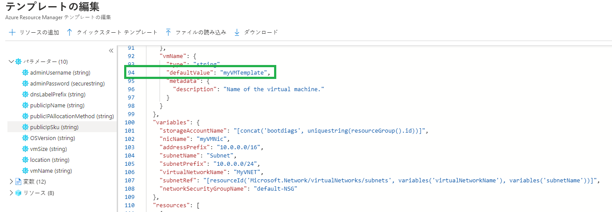
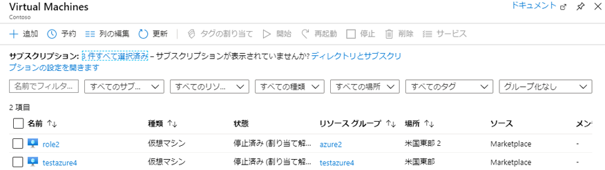
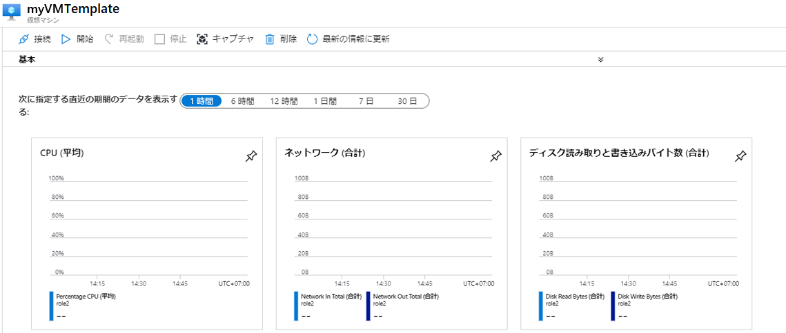
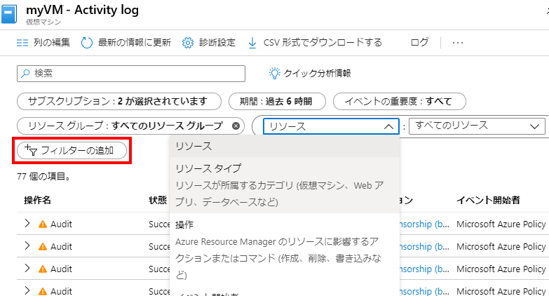

---
wts:
    title: '09 - テンプレートを使用して VM を作成する (10 分)'
    module: 'モジュール 03: コア ソリューションおよび管理ツールに関する説明'
---
# 09 - テンプレートを使用して VM を作成する (10 分)

このチュートリアルでは、クイック スタート テンプレートを使用して仮想マシンをデプロイし、監視機能を確認します。

# タスク 1: クイック スタート ギャラリーを探索し、テンプレートを見つける 

このタスクでは、クイック スタート ギャラリーを参照し、仮想マシンを作成するテンプレートをデプロイします。 

1. 新しいブラウザーウィンドウを開き、[https://azure.microsoft.com/ja-jp/resources/templates/?azure-portal=true](https://azure.microsoft.com/ja-jp/resources/templates/?azure-portal=true) と入力します。クイック スタート ギャラリーには、人気のあるテンプレートや最近更新されたテンプレートが公開されています。これらのテンプレートを使用すると、一般的なソフトウェア パッケージのインストールを含む、Azure リソースのデプロイを自動化できます。さまざまな種類のテンプレートを確認できます。

2. 「**Deploy a simple Windows VM**」を検索して選択します。

3. 「**Azure へのデプロイ**」ボタンをクリックします。ブラウザー セッションは自動的に [Azure portal](http://portal.azure.com/) にリダイレクトされます。

    **注**: 「**Azure へのデプロイ**」 ボタンを使用すると、テンプレートを Azure portal に直接デプロイできます。このようなデプロイの場合、一部の構成パラメーターのみが表示されます。 

4. 「**アカウントを選択する**」が表示されたら、**AzureStudent##**の資格情報を選択します。

5. Azure portalが表示されたら、「**テンプレートの編集**」をクリックします。ARMテンプレートは、JSON 形式で記述されています。パラメーターと変数を確認して変更する必要があります。仮想マシン名のパラメーター(vmName)を見つけます。「**defaultValue**」を 「**myVMTemplate##**」 に変更して、「**保存**」をクリックします。 

    

6. テンプレートにより必要とされるパラメーターを構成します (DNS ラベルのプレフィックスの **##$$$$** をグローバルで一意になるように文字と数字で置き換えます)。その他は既定値のままにします。 

    | 設定| 値|
    |----|----|
    | サブスクリプション | **Azure Pass - スポンサープラン** |
    | リソース グループ | **AzureStudent##** |
    | リージョン | **East US** |
    | Admin Username | **Student** |
    | Admin Password | **Pa55w.rd1234** |
    | Dns Label Prefix | **myvmtemplate##$$$$** |
    | OS バージョン | **2019-datacenter-gensecond** |

    注：##は受講番号を、$$$$は本日の月日を入力します。 (例：受講番号01、9月30日の場合→myvmtemplate010930)

7. 「**確認と作成**」をクリックします。

8. デプロイを監視します。 

# タスク 2: 仮想マシンのデプロイを確認および監視する

このタスクでは、正しくデプロイされた仮想マシンを確認します。 

1. Azure portalで、「**Virtual Machines**」 を検索して選択します。

2. 前のタスクで作成した仮想マシン(myVMTemplate## )が一覧に表示されていることを確認します。 

    

3. 仮想マシン(myVMTemplate##)を選択し、「**概要**」ブレードで「**監視**」タブを選択し、下にスクロールして監視データを表示します。

    **注**: 監視する期間は 1 時間から 30 日の幅で設定可能です。

4. 「**CPU (平均)**」、「**ネットワーク (合計)**」 を含むさまざまなグラフを確認します。 

    

5. 任意のグラフをクリックします。「**メトリックを追加**」 し、グラフの種類を変更できることに確認します。

6. 「**概要**」ブレードに戻ります。

7. 「**アクティビティ ログ**」をクリックします。アクティビティ ログには、リソースの作成や変更などのイベントが記録されます。 

8. 「**フィルターの追加**」 をクリックし、さまざまなイベントの種類と操作を検索してみます。 

    

テンプレートからリソースが正常に作成され、そのテンプレートが Azure にデプロイされました。
