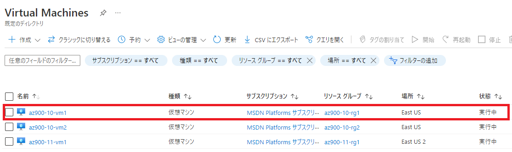
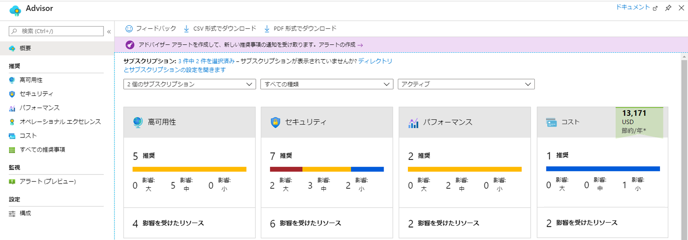
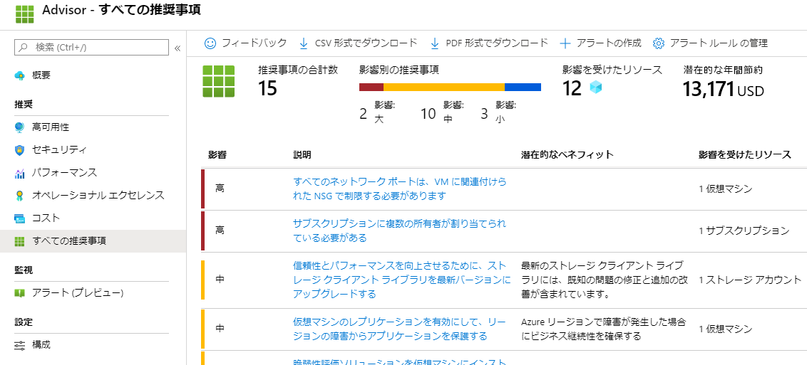

---
wts:
    title: '10 - PowerShell を使用して VM を作成する (10 分)'
    module: 'モジュール 03: コア ソリューションおよび管理ツールに関する説明'
---
# 10 - PowerShell を使用して VM を作成する (10 分)

このチュートリアルでは、Cloud Shell を構成し、Azure PowerShell モジュールを使用してリソース グループと仮想マシンを作成し、Azure Advisor の推奨事項を確認します。 

# タスク 1: Cloud Shell を設定する 

このタスクでは、Cloud Shell を構成します。 

1. Azure portal　([https://portal.azure.com](https://portal.azure.com))にサインインします。
2. Azure portal の右上にあるアイコンをクリックして、**Azure Cloud Shell** を開きます。

    

3. **Bash** と **PowerShell** のどちらかを選択するプロンプトが表示されたら、**PowerShell** を選択します。

4. **「ストレージがマウントされていません」** と表示されたら、サブスクリプションが「**Azure Pass - スポンサープラン**」となっていることを確認し、「**ストレージの作成**」をクリックします。


# タスク 2: リソース グループと仮想マシンを作成する

このタスクでは、PowerShell を使用して、リソース グループと仮想マシンを作成します。  

1. Cloud Shell 左上のドロップダウン メニューで、**「PowerShell」** が選択されていることを確認します。

2. 次のコマンドを実行して、リソース グループの一覧を確認します。

    ```PowerShell
    Get-AzResourceGroup | Format-Table
    ```

3. 次のコマンドを実行して、仮想マシンを作成します。 

    ```PowerShell
    New-AzVm `
    -ResourceGroupName "az900-10-rg1" `
    -Name "az900-10-vm1" `
    -Location "East US" `
    -VirtualNetworkName "az900-10-vnet1" `
    -SubnetName "subnet1" `
    -SecurityGroupName "az900-10-nsg1" `
    -PublicIpAddressName "az900-10-pip1"
    ```
    
4. プロンプトが表示されたら、ユーザー名 (**Student**) とパスワード (**Pa55w.rd1234**) を入力します。これらは、その仮想マシンのローカル管理者アカウントとして構成されます。

5. VM が作成されたら、CloudShell を閉じます（CloudShell 右上の×ボタン）。

6. Azure portal で、「**Virtual Machines**」を検索し、「**az900-10-vm1**」 が作成、実行されていることを確認します。デプロイには数分かかることがあります。

    

7. **az900-10-vm1**を選択し、「概要」 と 「ネットワーク」 の設定を確認して、正しくデプロイされていることを確認します。 

# タスク 3: Cloud Shell でコマンドを実行する

このタスクでは、Cloud Shell から PowerShell コマンドを実行する練習を行います。 

1. Azure portal の右上にあるアイコンをクリックして **Azure Cloud Shell** を開きます。

2. Cloud Shell 左上のドロップダウン メニューで、**「PowerShell」** が選択されていることを確認します。

3. 次のコマンドを実行して、仮想マシンの名前、リソース グループ、場所、状態などの情報を取得します。**PowerState** が「**VM running**」になっていることを確認します。

    ```PowerShell
    Get-AzVM -name az900-10-vm1 -status | Format-Table -autosize
    ```

4. 次のコマンドを使用して仮想マシンを停止します。 

    ```PowerShell
    Stop-AzVM -ResourceGroupName az900-10-rg1 -Name az900-10-vm1
    ```
5. プロンプトが表示されたら、「**yes**」 と入力します。実行したコマンドが完了するのを待ちます。

6. 再度、仮想マシンの状態を確認します。**PowerState** が「**VM deallocated**」、つまり**割り当て解除済み**の状態となっていることが確認できます。ポータル上でも仮想マシンの状態は確認することができます。CloudShell を閉じます。

    ```PowerShell
    Get-AzVM -name az900-10-vm1 -status | Format-Table -autosize
    ```

# タスク 4: Azure Advisor の推奨事項を確認する

**注:** このタスクは、「ラボ11 - CLI を使用して VM を作成する」にあるタスクと同じです。 

このタスクでは、仮想マシンの Azure Advisor の推奨事項を確認します。 

1. Azure portalで「**アドバイザー**」 を検索して選択します。 

2. **「アドバイザー」** ブレードで、**「概要」** を選択します。通知は、信頼性、セキュリティ、パフォーマンス、コスト別にグループ化されて表示されます。 

    

3. 「**推奨**」セクションの「**すべての推奨事項**」 を選択し、各推奨事項と推奨されるアクションを表示します。 

    **注:** リソースに応じて、推奨事項は異なります。 

    

4. 推奨事項を CSV または PDF ファイルとしてダウンロードできることを確認してください。 

5. アラートを作成できることを確認してください。 

ここでは、Cloud Shell を構成し、PowerShell を使用して仮想マシンを作成し、PowerShell コマンドで練習し、Advisor の推奨事項を確認しました。

**注**: 追加コストを回避するために、作成したリソース グループを削除できます。リソース グループを検索して選択し、作成したリソース グループをクリックして、「**リソース グループの削除**」をクリックします。リソース グループの名前を入力し、「**削除**」をクリックします。**通知**を監視して、削除の進行状況を確認します。
