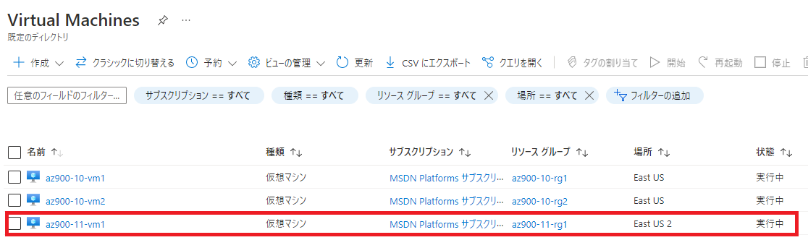
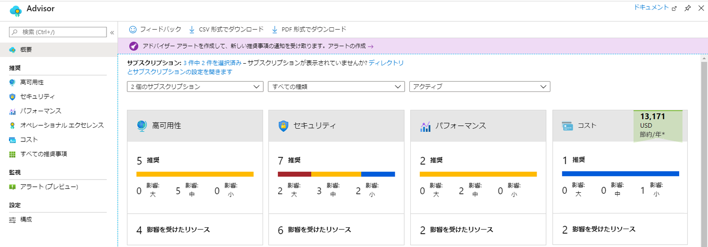
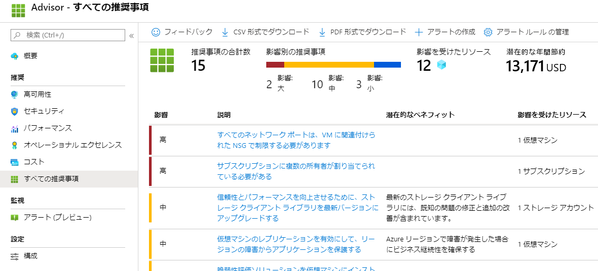

---
wts:
    title: '11 - CLI を使用して VM を作成する (10 分)'
    module: 'モジュール 03: コア ソリューションおよび管理ツールに関する説明'
---
# 11 - CLI を使用して VM を作成する (10 分)

このチュートリアルでは、Cloud Shell を構成し、Azure CLI を使用してリソース グループと仮想マシンを作成し、Azure Advisor の推奨事項を確認します。 

# タスク 1: Cloud Shell を設定する 

このタスクでは、Cloud Shell を構成してから、Azure CLI を使用して、リソース グループと仮想マシンを作成します。  

1. Azure portal　([https://portal.azure.com](https://portal.azure.com))にサインインします。

2. Azure portal の右上にあるアイコンをクリックして、**Azure Cloud Shell** を開きます。

    

3. **Bash** と **PowerShell** のどちらかを選択するプロンプトが表示されたら、**Bash**を選択します。 

    **注**：表示されない場合は、CloudShell左上のドロップダウンリストからBashを選択します。

4. **「ストレージがマウントされていません」** と表示された場合、サブスクリプションが「**Azure Pass - スポンサープラン**」となっていることを確認し、「**ストレージの作成**」をクリックします。


# タスク 2: CLI  を使用して、仮想マシンを作成します

このタスクでは、Azure CLI を使用して、リソース グループと仮想マシンを作成します。

1. Cloud Shell 左上のドロップダウン リストで、**「Bash」** が選択されていることを確認します （選択されていない場合は選択して切り替えます）。

    


2. 次のコマンドを入力して、リソース グループを確認します。

    ```cli
    az group list --output table
    ```

3. Cloud Shell で以下のコマンドを入力し、最後の行を除くすべての行の最後がバックスラッシュ (`\`) 文字であることを確認します。同じ行にコマンド全体を入力する場合、バックスラッシュ文字は使用しないでください。 

    ```cli
    az group create \
    --name az900-11-rg1 \
    --location EastUS2
    az vm create \
    --name az900-11-vm1 \
    --resource-group az900-11-rg1 \
    --image UbuntuLTS \
    --location EastUS2 \
    --admin-username student \
    --admin-password Pa55w.rd1234
    ```

    > **注**: Windows コンピューターのコマンド ラインを使用している場合は、バックスラッシュ (`\`) 文字をキャレット (`^`) 文字で置き換えます。

    **注**: コマンドの完了には 2 分から 3 分かかります。このコマンドは、仮想マシンと、関連するストレージ、ネットワーク、セキュリティ リソースなどのさまざまなリソースを作成します。仮想マシンのデプロイが完了するまで、次の手順に進まないでください。 

4. コマンドの実行が終了したら、Cloud Shell を閉じます。

5. Azure portal で 「**Virtual Machine**」を検索して選択し、**az900-11-vm1** が実行されていることを確認します。

    


# タスク 3: Cloud Shell でコマンドを実行する

このタスクでは、Cloud Shell から CLI コマンドを実行します。 

1. Azure portal の右上にあるアイコンをクリックして、**Azure Cloud Shell** を開きます。

2. Cloud Shell 左上のドロップダウン メニューで、**「Bash」** が選択されていることを確認します。

3. 次のコマンドを実行して、仮想マシンの名前、リソース グループ、場所、状態などの情報を取得します。**PowerState** が「**VM running**」であることを確認してください。

    ```cli
    az vm show --resource-group az900-11-rg1 --name az900-11-vm1 --show-details --output table 
    ```

4. 仮想マシンを停止します。仮想マシンの割り当てが解除されるまで請求が続行されることを示すメッセージが表示されます。 

    ```cli
    az vm stop --resource-group az900-11-rg1 --name az900-11-vm1
    ```

5. 再度、仮想マシンの状態を確認します。**PowerState**が「**VM stopped**」となっていれば、VMが停止していることを確認できました。

    ```cli
    az vm show --resource-group az900-11-rg1 --name az900-11-vm1 --show-details --output table 
    ```

# タスク 4: Azure Advisor の推奨事項を確認する

このタスクでは、Azure Advisor の推奨事項を確認します。

   **注:** 前のラボ (「PowerShell を使用して VM を作成する」) を完了している場合、このタスクはすでに実行済みです。 

1. Azure portalで**「アドバイザー」** を検索して選択します。 

2. **「アドバイザー」** ブレードで、**「概要」** を選択します。通知は、信頼性、セキュリティ、パフォーマンス、コスト別にグループ化されて表示されます。 

    

3. 「**推奨**」セクションの**「すべての推奨事項」** を選択し、各推奨事項と推奨されるアクションを表示します。 

    **注:** リソースに応じて、推奨事項は異なります。 

    

4. 推奨事項を CSV または PDF ファイルとしてダウンロードできることを確認してください。 

5. アラートを作成できることを確認してください。 

Cloud Shell を構成し、Azure CLI を使用して仮想マシンを作成し、Azure CLI コマンドで練習し、Advisor の推奨事項を確認しました。

**注**: 追加コストを回避するために、作成したリソース グループを削除できます。リソース グループを検索して選択し、作成したリソース グループをクリックして、「**リソース グループの削除**」をクリックします。リソース グループの名前を入力し、「**削除**」をクリックします。**通知**を監視して、削除の進行状況を確認します。
