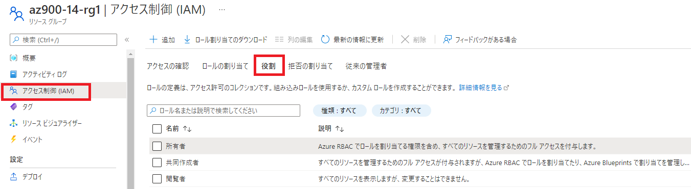
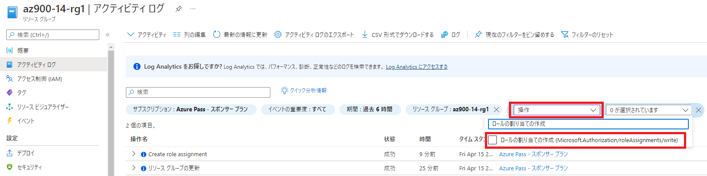

---
wts:
    title: '14 - RBAC を使用したアクセスの管理 (5 分)'
    module: 'モジュール 05: ID、ガバナンス、プライバシー、およびコンプライアンス機能に関する説明'
---
# 14 - RBAC を使用したアクセスの管理 (5 分)

このチュートリアルでは、リソースにロールを割り当て、ログを表示します。

# タスク 1: ロールの表示と割り当て

このタスクでは、仮想マシンの共同作成者ロールを割り当てます。 

1. Azure portal　([https://portal.azure.com](https://portal.azure.com))にサインインします。

2. Azure portalで、「**リソース グループ**」を検索して選択し、**「+ 作成」** をクリックします。

3. 以下の内容で新しいリソース グループを作成します。 

    | 設定 | 値 |
    | -- | -- |
    | サブスクリプション | **Azure Pass - スポンサープラン** |
    | リソース グループ | **az900-14-rg1** |
    | リージョン | **(US) East US** |

4. 「**確認および作成**」 をクリックし、「**作成**」 をクリックします。

5. リソース グループブレードで 「**更新**」をクリック して、**新しく作成したリソース グループ(az900-14-rg1)**を表すエントリをクリックします。

6. 「**アクセスの制御 (IAM)**」 ブレードをクリックして、「**役割**」 タブに切り替えます。使用可能な多数のロール定義を確認できます。

7. 「**az900-14-rg1 - アクセスの制御 (IAM)**」ブレードの「**ロールの割り当て**」タブに切り替え、「**+ 追加**」をクリックして「**ロールの割り当ての追加**」をクリックします。「**仮想マシン共同作成者**」のロールを検索して、選択します。「**次へ**」をクリックして、アクセスを以下の通りに割り当てます。

   | 設定                 | 値                                                           |
    | -------------------- | ------------------------------------------------------------ |
    | アクセスの割り当て先 | **ユーザー、グループ、またはサービス プリンシパル**          |
    | メンバー             | **ご自身のユーザ([ctcXXXX@outlook.jp](mailto:ctcXXXX@outlook.jp))** |
    
    **注**：仮想マシン共同作成者のロールでは仮想マシンを管理できますが、そのオペレーティング システムにアクセスしたり、接続先の仮想ネットワークやストレージ アカウントを管理したりすることはできません。
    
7. 「**レビューと割り当て**」をクリックして、ロールを割り当てます。

7. 「ロールの割り当て」ページを**更新**し、仮想マシンの共同作成者として表示されていることを確認します。 

   **注**: 共同作成者ロールに関連する権限すべてを有する所有者のロールをアカウントがすでに有しているため、この割り当てにより付加的な権限が付与される訳ではありません。
    
    

# タスク 2: ロールの割り当てを確認し、ロールを削除する

このタスクでは、アクティビティ ログを表示してロールの割り当てを確認し、ロールを削除します。 

1. 「az900-14-rg1 リソース グループ」ブレードで、「**アクティビティ ログ**」 をクリックします。

2. 「**フィルターの追加**」 をクリックして 「**操作**」 を選択し、「**ロールの割り当ての作成**」 を検索してクリックします。

    

3. アクティビティ ログにロールの割り当てが表示されていることを確認します。 

リソース グループを作成し、それにアクセス ロールを割り当て、アクティビティ ログを表示しました。 

**注**: 追加コストを回避するために、作成したリソース グループを削除できます。リソース グループを検索して選択し、作成したリソース グループをクリックして、「**リソース グループの削除**」をクリックします。リソース グループの名前を入力し、「**削除**」をクリックします。**通知**を監視して、削除の進行状況を確認します。
