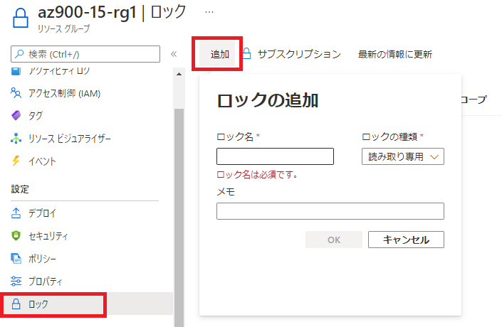
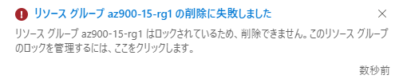
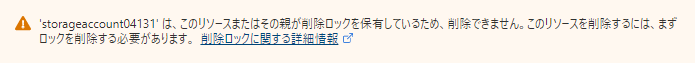
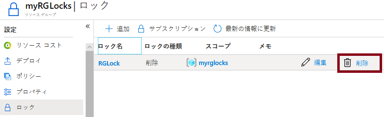

---
wts:
    title: '15 - リソース ロックの管理 (5 分)'
    module: 'モジュール 05: ID、ガバナンス、プライバシー、およびコンプライアンス機能に関する説明'
---
# 15 - リソース ロックの管理 (5 分)

このチュートリアルでは、リソース グループにロックをかけた後、リソース グループを削除できるかテストします。サブスクリプションにおいては、リソース グループ、または個々のリソースにロックをかけることで、重要なリソースが誤って削除または変更されるのを防ぐことができます。  

# タスク 1:  リソース グループにロックを追加し、削除をテストする

このタスクでは、リソース グループにリソース ロックを追加し、リソース グループの削除をテストします。 

1. Azure portal　([https://portal.azure.com](https://portal.azure.com))にサインインします。

2. Azure portalで、「**リソース グループ**」を検索して選択し、**「+ 作成」** をクリックします。

3. 以下の内容で新しいリソース グループを作成します。 

    | 設定                          | 値                                |
    | ----------------------------- | --------------------------------- |
    | サブスクリプション            | **Azure Pass - スポンサープラン** |
    | リソース グループ（新規作成） | **LockAzureStudent##**            |
    | リージョン                    | **(US) East US**                  |

4. 「**確認および作成**」 をクリックし、「**作成**」 をクリックします。

5. 作成したリソースグループのブレードに移動し、「**設定**」セクションの「**ロック**」をクリックし、「**+ 追加**」をクリックします。

    **注**：サブスクリプション、リソース グループ、または個々のリソースにロックを適用して、重要なリソースが誤って削除または変更されるのを防ぐことができます。 

    

6. 新しいロックを構成します。完了したら、「**OK**」をクリックします。 

    | 設定 | 値 |
    | -- | -- |
    | ロック名 | **RGLock** |
    | ロックの種類 | **削除** |

7. 「**概要**」ブレードに移動し、「**リソース グループの削除**」をクリックします。リソース グループ名を入力し、「**OK**」をクリックします。リソース グループがロックされ、削除できないことを示すエラー メッセージが表示されます。

    

# タスク 2: リソース グループのメンバーの削除をテストする

このタスクでは、リソース ロックがリソース グループのストレージ アカウントを保護するかどうかをテストします。 

1. Azure portalで 「**ストレージ アカウント**」 を検索して選択し、**「+ 作成」** のいずれかをクリックします。 

2. 「**ストレージ アカウントを作成する**」ブレードで、次の情報を入力します。その他は既定値のままにします。

    | 設定 | 値 |
    | --- | --- |
    | サブスクリプション | **Azure Pass - スポンサープラン** |
    | リソース グループ | **LockAzureStudent##** |
    | ストレージ アカウント名 | **storageaccount##$$$$** |
    | 地域 | **(US) East US** |
    | パフォーマンス | **Standard** |
    | 冗長性 | **ローカル冗長ストレージ (LRS)** |
    
    注：##は受講番号を、$$$$は本日の月日を入力します。 (例：受講番号01、9月30日の場合→eduwebapps010930)
    
    

3. 「**確認および作成**」 をクリックして、検証が完了したら「**作成**」 をクリックします。

5.  ストレージ アカウントが正常に作成されたことを示す通知を待ちます。 

6. デプロイが完了したら「**リソースに移動**」をクリックし、 「**概要**」 ブレードで 「**削除**」 をクリックします。リソースまたはその親のリソースの削除がロックされていることを示すエラー メッセージが表示されます。 

    

    **注**: ストレージ アカウントに対してロックは作成しませんでしたが、ストレージ アカウントを含むリソース グループ レベルでロックを作成しました。このように、この*親*レベルのロックを継承することで、ストレージ アカウントは削除ロックが適用されています。

# タスク 3: リソース ロックを解除する

このタスクでは、リソースロックを解除してテストします。 

1. 「**az900-15-rg1**」 リソース グループ ブレードに戻り、「**設定**」 セクションで 「**ロック**」 をクリックします。
   
2. 「**RGLock**」エントリの右端（「**編集**」 の右側）にある 「**削除**」 リンクをクリックします。

    

3. タスク2で作成したストレージ アカウントのブレードに戻り、リソースを削除できるようになったことを確認します。

リソース グループを作成し、リソース グループにロックを追加して削除をテストしました。その後、リソース グループ内のリソース ロックを削除して、リソースの削除をテストしました。 
