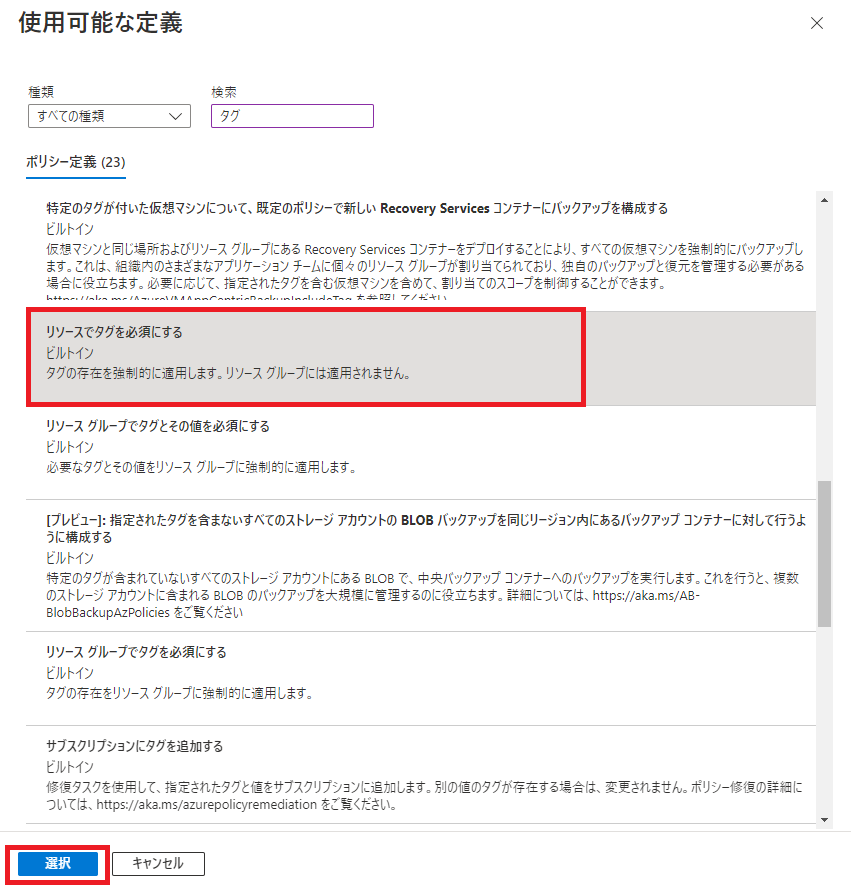
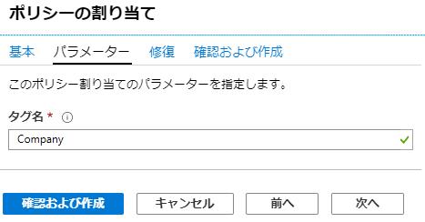
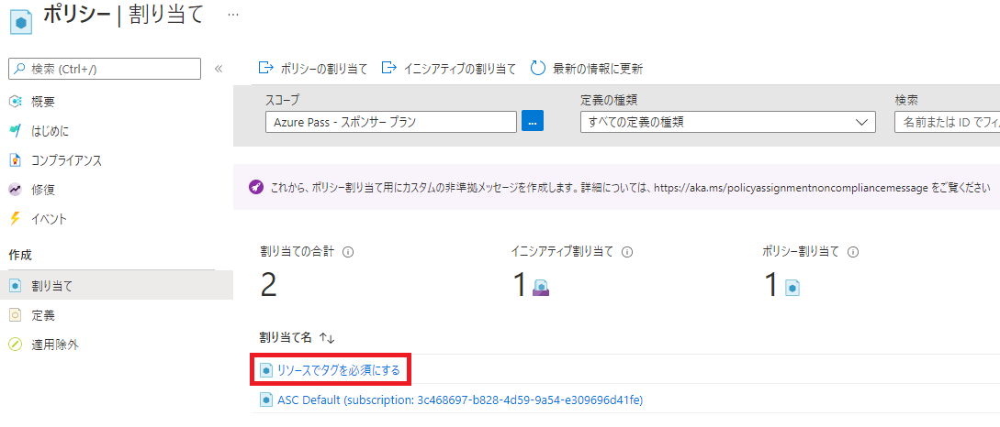
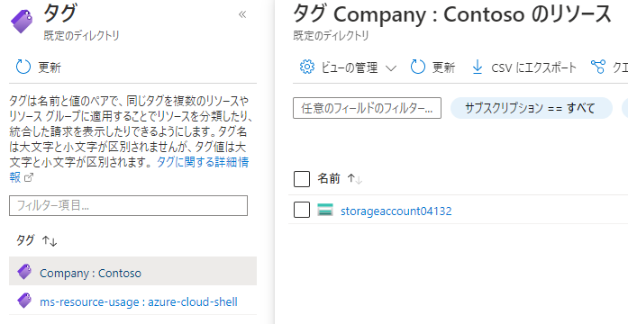
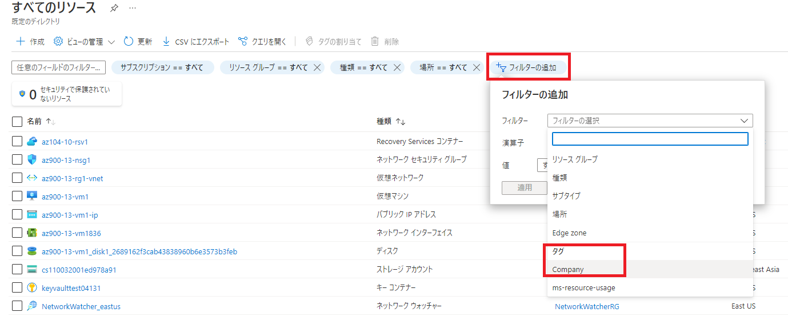

---
wts:
    title: '16 - リソースのタグ付けを実装する (5 分)'
    module: 'モジュール 05: ID、ガバナンス、プライバシー、およびコンプライアンス機能に関する説明'
---
# 16 - リソースのタグ付けを実装する

このチュートリアルでは、タグ付けが必要なポリシー割り当てを作成し、ストレージ アカウントを作成してタグ付けをテストし、指定したタグを持つリソースを表示し、タグ付けポリシーを削除します。

# タスク 1: ポリシー割り当てを作成する 

このタスクでは、「**リソースでタグを必須にする**」 ポリシーを構成して、そのポリシーにサブスクリプションを割り当てます。 

1. Azure portal　([https://portal.azure.com](https://portal.azure.com))にサインインします。

2. Azure portalで「**ポリシー**」 を検索して選択します。

3. 「**作成**」 セクションの「**スコープ**」はそのままにし、サブスクリプション全体にポリシーを割り当てます。

4. 「**割り当て**」 をクリックし、ページ上部の 「**ポリシーの割り当て**」 をクリックします。

5. 「**基本**」 タブでは、「**ポリシー定義**」右側の三点リーダ(...)をクリックします。 「**検索**」 ボックスに 「**タグ**」 と入力します。検索結果から「**リソースでタグを必須にする**」を探し、クリックしてから「**選択**」をクリックします。

   

6. 「**割り当て名**」にはポリシー定義と同様に、「**リソースでタグを必須にする**」を入力し、「**次へ**」をクリックします。

7. 「**タグ名**」には、「**Company**」と入力します。「**確認および作成**」をクリックし、「**作成**」をクリックします。

   

8. 「**リソースでタグが必要**」ポリシーの割り当てが適用されました。リソースの作成時に必ずタグを含める必要があります。
   **注 - ポリシーが適用されるまで最大 30 分待つ必要があります。** 

   

# タスク 2: ストレージアカウントを作成して、必要なタグ付けをテストする

このタスクでは、ストレージ アカウントを作成して、必要なタグ付けをテストします。 

1. Azure Portal で、「**ストレージ アカウント**」を検索して選択し、**「+ 作成」** をクリックします。

2. 「**ストレージ アカウントを作成する**」 ブレードの 「**基本**」 タブで次の情報を入力します (ストレージ アカウントの名前の **xxxx** は、名前がグローバルに一意になるように文字と数字に置き換えます)。その他は既定値のままにします。

    | 設定 | 値 |
    | --- | --- |
    | サブスクリプション | **Azure Pass - スポンサープラン** |
    | リソース グループ（新規作成） | **az900-16-rg1** |
    | ストレージ アカウント名 | **storageaccountxxxx** |
    | 地域 | **(US) East US** |

3. 「**確認および作成**」をクリックします。 

    **注:** タグ付けをしていない場合に何が起こるかを確認します。ポリシーが有効になるまで最大 30 分かかる場合があることに注意してください。

4. 次の確認失敗メッセージが表示されます。 「**ここをクリックして詳細を表示**」 メッセージをクリックします。 「**エラー**」 ブレードの 「**概要**」 タブで、ポリシーによりリソースが許可されていないことを示すエラー メッセージを書き留めます。

    **注記:** 「未処理エラー」タブを表示すると、必要な特定のタグ名が表示されます。 

    

5. 「**エラー**」ペインを閉じ、画面の下部にある 「**前へ**」 をクリックします。タグ付け情報を入力します。 

    | 設定 | 値 |
    | --- | --- |
    | 名前 | **Company** |
    | 値 | **Contoso** |

6. 「**確認および作成**」 をクリックし、検証が成功したことを確認します。 「**作成**」 をクリックしてストレージ アカウントをデプロイします。 

# タスク 3: 特定のタグを持つすべてのリソースを表示します

1. Azure Portal で、「**タグ**」 を検索して選択します。

2. 「**Company : Contoso**」キー/値のペアをクリックします。これにより、デプロイにおいてタグが含まれていれば、新しく作成したストレージ アカウントを示すブレードが表示されます。 

   

3. Azure portal で、「**すべてのリソース**」ブレードを表示します。

4. 「**フィルターの追加**」をクリックし、フィルターのカテゴリとして **Company** タグ キーを追加します。フィルターが適用されると、自分のストレージ アカウントのみがリストされます。

    

# タスク 4: ポリシーの割り当てを削除する

このタスクでは、「**リソースでタグを必須にする**」ポリシーを削除して、今後の作業に影響が及ばないようにします。 

1. Azure portalで、「**ポリシー**」 を検索して選択します。
2. 「**リソースでタグを必須にする**」 ポリシー エントリをクリックします。
3. 上部メニューから 「**割り当ての削除**」 をクリックします。
4. 「**はい**」 をクリックして、ポリシー割り当てを削除できることを確認します。

このチュートリアルでは、タグ付けが必要なポリシー割り当てを作成し、リソース (ストレージ アカウント) を作成して、タグ付けのポリシーをテストしました。

**注**: 追加コストを回避するために、作成したリソース グループを削除できます。リソース グループを検索して選択し、作成したリソース グループをクリックして、「**リソース グループの削除**」をクリックします。リソース グループの名前を入力し、「**削除**」をクリックします。**通知**を監視して、削除の進行状況を確認します。
